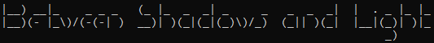

</img>

Between Shadows and Light was one of my first games
ever, created in 2018. It was meant to be open world text
RPG, letting you roam across places from my universe, Baedoor.

While buggy in so many levels, it was much more complex than
anything I created before, and let player experience a lot of
depth I envisioned it to have. That said, it being written
entirely in Polish it made little sense to showcase it.

I wanted to remake BSaL for a long time, but my first attempt
on it, called [Isle of Ansur](https://github.com/Toma400/The_Isle_of_Ansur)
became creature on its own and nowadays, it doesn't resemble BSaL
in nothing except being located in the same area.

### Remake
That's why I decided to start writing a remake - a proper, terminal
version, like the BSaL from seven years ago.
It is meant to preserve almost every of original's quirks, but
improve its code quality, make it crash-free and fix the more
important bugs. And, most importantly, provide English version, so
that more people can see how BSaL looked and felt.

### Roadmap
| Version | Features planned                                                                                                           |
|:-------:|:---------------------------------------------------------------------------------------------------------------------------|
|   1.0   | Exact features from original BSaL, fixing CTD issues and broken quests that didn't "be buggy as a feature"                 |
|   1.1   | Fixing any bugs found in 1.0                                                                                               |
|   1.2   | Expanding BSaL in a way that let you utilise all unused items                                                              |
|   1.3   | Expanding BSaL with more locations/NPCs so that all unused mechanics are used (ideally also making use of more statistics) |
|   1.4   | Adding more translations provided by community                                                                             |

Any updates past 1.4 are unlikely, but if new translation is added, it may be a reason
for me to make new version just to add it.

### Features
- A hand-crafted steampunk/fantasy world, Baedoor
- Four locations
- Twelve NPCs
- Two quests
- Two semi-quests
- A narrative-rich tutorial
- Various immersive systems (banking, reading, sleeping needs) alongside well-known ones,
  such as crafting (smithing, cooking, alchemy)
- Engaging turn-based combat

### Differences
- Added language support
- Disabled ormath shaman as somewhat difficult to implement class bringing no real value
- Adjusted race names to revised lore (human -> baedoorian, nord -> vindean, saphtri -> pahtri (due to description))
- Added gunpowder to registry, as an item only partially introduced in OG (not foundable
  however, it will be implemented in 1.2+)
- Added unique options to docked ship, since OG haven't made any explicit changes, resulting
  in NPCs behaving the same before and after MQ took place, being unaware of it entirely
- Minimal QoL additions (most notably in additional text guiding through GUI)
- Fixed bug allowing you to repeat magician quest, cheesing the reward
  - Quest is now doable only once, but gives you also experience points (in OG it didn't)
- Fixed merchant's selling you papyrus, as it was likely meant to be parchment
- Fixed normal attack using `swords` skill even if using firearm/ranged weapon
- Overhauled ranged combat so that not having ammo does not yield attack have zero effect,
  but use default fist damage (modeled after how standard attack does it for ranged weapons)
- Cheats slightly changed
  - You can't go back to abandoned island after going to Evros
  - You can heal yourself during the fight
- Poisoning has levels that inflict stronger penalties (based on OG using `int` type for
  poisoning instead of bool)
  - To bring the point home, antidotes are also leveled
- Added herring cooking recipe, absent in OG despite herring having cooked variant
- Removed weird limitation for spell casting not being possible after level 3
- Slightly tweaked and expanded TG quest dialogue, introducing us to our hire who now
  has a name
  - Adjusted Hrevir dialogue to not indicate him being in (West) Baedoor, per new ATG
    lore and keeping scope to Ansur only
  - Raised TG quest experience reward to 20 due to the quest being fairly difficult
  - Made TG recommendation letter description, as it was lacking in OG

### New features (1.2+ version)
- if not available already: trading would improve trade skill, and trade skill would
  lower the prices?
- decrease level cap? (100 xp for second level is ridiculous)
- smithing recipes for level 2/3? maybe actually make level 1 get less items
- also make smith be able to train you in smithing (both for 0->1 and 1->2/3), maybe for
  plenty of money
- similarly, make repair *chance* depending on repair skill? otherwise it's useless
  skill; and make smithing and repair have chance to improve your skill after success
  - note: it may be that `repair` was meant just for vehicle-sque things, see `tut4`
    string that explains it.. definitely a shit to be more precise in BRPGS 3.0
- add gunpowder to warehouse chest so it can be found in BSaL
- while the game actually tells you in tutorial alchemy skills can affect chances of you
  making potion, it doesn't do anything to actually gatekeep that - so if we were to add
  more potions, it'd make sense to make something that rolls against player's skill
- add `try to escape` option to fights, with `combat/fight` proc bool argument that says
  if we can do so
  - there could be two escapes - one before the fight (when you can choose sneaking) and
    one during battle; the before-fight option would have higher chance to avoid fight
  - though this escapability should be gated and/or have dedicated result (former option
    is easier) because e.g. if we escape wounded pirate in MQ, we would probably let
    captain be killed, which would have consequence for MQ
- make all GUI options work upon numbers, not writing down letters
- big health/mana potions, big health potion should also be weak antidote (level -1)?
- change RNG for normal pirate to 1?
- fishing? since `herring` is ultimately useless, you can't roast it nor get it
  and it would be nice way to gather food, very baedoorey as well
- second spell for staffs
  - conn should have `paralysis` because otherwise it makes little sense to use
    this staff, as you need a lot to do just to... heal yourself?
  - maybe conn could even have three spells, with one being small damage?
  - survey for staffs being achievable in game even
- some new books, this time pickable? maybe even one more magazine that would
  change over time
- questing
  - Thieves Guild
    - TG follow-up quest to expand on changed lore & offer any questline-like experience
      that it was meant to have (Hrevir is our contact)
    - being able to enter warehouse no matter the time, just having additional
      check for skills (should count for both TG quest *and* reentering)
    - being able to report warehouse theft even after rejecting the offer
    - set the timer after you "leave" the warehouse when night comes, so that there
      can be some sort of penalty (but `echo` that so player knows)
    - chests in warehouse should also be locked?
    - redesign quest slightly so that warehouse entering is separate dialogue
      and maybe allow you to loot more than one chest
    - being able to be caught? for now the quest and getting into warehouse is very
      forgiving
    - set lock-after-burglary to 8, so that only guards attention is higher, but lock
      level remains the same - makes little sense to up its level here

### New cheats systematised (to be transferred to BE)
- `cheat` in main menu transports you out of tutorial and gives some resources
  (to be replaced later)
- combat
  - `heal` - heals you to maximum health
  - `kill` - kills enemy immediately

### Lore notes (to be transferred to BE and removed from here)
- "Pod Złotym Szczurem" (Under Golden Rat) tavern in Evros
- "Magiczny Wywar" (Magical Brew) shop in Evros (potentially one of FotB initial members?)
- Sailor's name is Sam
- (website) 29.7.18 - new version
